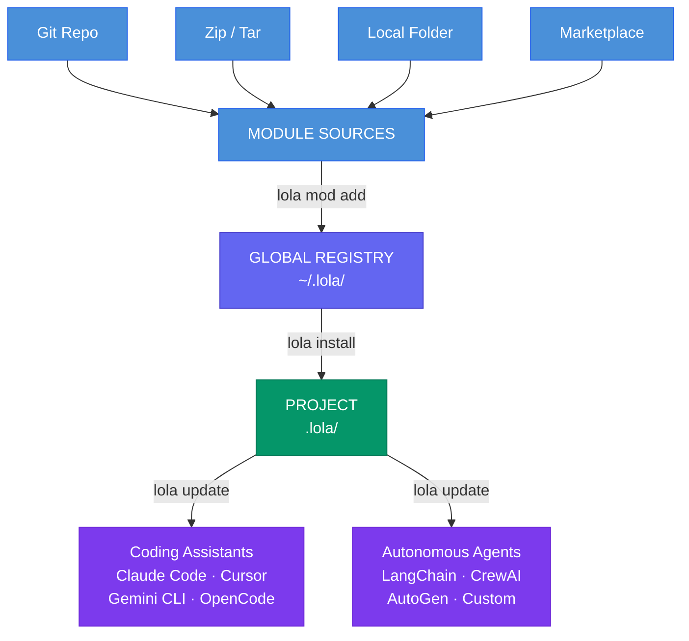

# What is Lola?

Lola is a universal AI Context Package Manager — and the foundation for **AI as Code**.

!!! quote ""
    If a Skill were a package, Lola would be the package manager for it.

Write your [skills and context modules](skills-and-modules.md) once as portable packages, then install them to any AI assistant or agent with a single command. Agent settings, MCP configurations, skills, commands, and context dependencies — all managed as code, versioned, and distributable.

```bash
lola mod add https://github.com/myorg/compliance-skills.git
lola install compliance-skills
```

## How It Works



- **`lola mod add`** — fetches a module into the global registry (`~/.lola/modules/`)
- **`lola install`** — installs from the registry into the project, generating native files per target
- **`lola update`** — regenerates all target-specific files from installed modules
- **`lola sync`** — installs everything declared in `.lola-req` (team declarative management)

## Where Lola Is Heading

Lola started as a way to share context across AI coding assistants. The vision is broader: make Lola the standard distribution layer for AI context across **any agent** — coding assistants and fully autonomous systems alike.

- [Roadmap](roadmap.md) — universal agent support, trusted catalogs, supply chain security
- [Why Lola](why-lola.md) — how Lola compares to alternatives in this space

## Guides

- [Modules](../guides/modules.md) · [Marketplace](../guides/marketplace.md) · [Declarative](../guides/declarative.md) · [Install Hooks](../guides/install-hooks.md) · [MCP Servers](../guides/mcp-servers.md)
