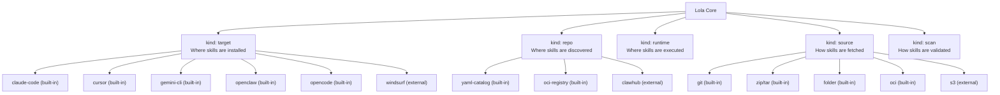
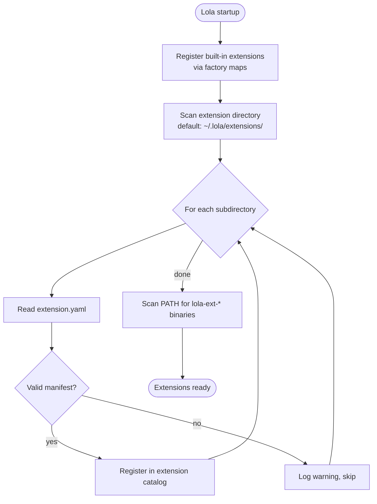

# Extension Architecture — Implementation Design

Paired with [ADR-0003: Extension Architecture](../../adr/0003-extension-architecture.md).

## Extension Kind Taxonomy



## Extension Discovery Flow



## Extension Manifest Schema

```yaml
# Required fields
name: string          # Display name
kind: string          # One of: target, repo, runtime, source, scan
description: string   # Brief description of what this extension does
executable: string    # Filename of the executable to invoke

# Optional fields
version: string       # Semantic version
author: string        # Author name or organization
license: string       # SPDX license identifier
```

## Hello World: Bash Target Extension

A minimal target extension that installs skills to a custom directory.

**Directory structure:**
```text
~/.lola/extensions/hello-target/
├── extension.yaml
└── hello-target.sh
```

**extension.yaml:**
```yaml
name: "Hello Target"
kind: target
description: "A simple hello world target extension"
executable: "hello-target.sh"
author: "Your Name"
license: "MIT"
version: "0.1.0"
```

**hello-target.sh:**

> **Prerequisites:** requires [`jq`](https://jqlang.github.io/jq/) for JSON parsing.

```bash
#!/bin/bash
set -e

input=$(cat)
action=$(echo "$input" | jq -r '.action')

case "$action" in
  "install")
    skill_name=$(echo "$input" | jq -r '.skill_name')
    dest_path=$(echo "$input" | jq -r '.dest_path')
    content=$(echo "$input" | jq -r '.content')

    mkdir -p "$dest_path"
    echo "$content" > "$dest_path/$skill_name.md"

    echo '{"status": "ok", "installed": ["'"$skill_name"'"]}' ;;

  "remove")
    skill_name=$(echo "$input" | jq -r '.skill_name')
    dest_path=$(echo "$input" | jq -r '.dest_path')
    rm -f "$dest_path/$skill_name.md"

    echo '{"status": "ok", "removed": ["'"$skill_name"'"]}' ;;

  "paths")
    echo '{"skills": ".hello/skills", "commands": ".hello/commands"}' ;;

  *)
    echo '{"status": "error", "message": "unknown action"}' >&2
    exit 1 ;;
esac
```

**Setup:**
```bash
chmod +x ~/.lola/extensions/hello-target/hello-target.sh
```

**Usage:**
```bash
lola ext add ./hello-target/
lola install my-module -a hello-target
```

## Hello World: Python Repo Extension

A repo extension providing search and resolve for a custom skill catalog.

**Directory structure:**
```text
~/.lola/extensions/my-catalog/
├── extension.yaml
└── my-catalog.py
```

**extension.yaml:**
```yaml
name: "My Catalog"
kind: repo
description: "Search and install skills from my custom catalog"
executable: "my-catalog.py"
version: "0.1.0"
```

**my-catalog.py:**
```python
#!/usr/bin/env python3
import json
import sys

CATALOG = [
    {"name": "react-skills", "version": "2.0", "description": "React development skills",
     "repository": "https://github.com/example/react-skills.git"},
    {"name": "security-audit", "version": "1.0", "description": "Security auditing skills",
     "repository": "https://github.com/example/security-audit.git"},
]

try:
    request = json.loads(sys.stdin.read())
    action = request["action"]
except (json.JSONDecodeError, KeyError) as e:
    print(json.dumps({"error": str(e)}), file=sys.stderr)
    sys.exit(1)

if action == "search":
    query = request["query"].lower()
    results = [m for m in CATALOG if query in m["name"] or query in m["description"].lower()]
    print(json.dumps({"results": results}))

elif action == "resolve":
    name = request["name"]
    match = next((m for m in CATALOG if m["name"] == name), None)
    if match:
        print(json.dumps(match))
    else:
        print(json.dumps({"error": f"module '{name}' not found"}))
        sys.exit(1)

elif action == "list":
    print(json.dumps({"results": CATALOG}))
```

**Setup:**
```bash
chmod +x ~/.lola/extensions/my-catalog/my-catalog.py
```

**Usage:**
```bash
lola ext add ./my-catalog/
lola search react
lola install react-skills
```

## Protocol Transport

The initial protocol uses stdin/stdout for simplicity. The architecture supports evolving to gRPC as a future transport option without changing extension interfaces — only the transport layer in `internal/extensions/` would change.

```text
Core → [write request to stdin] → Extension process → [read response from stdout] → Core
```
