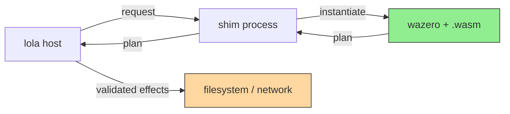

# Extension Sandboxing — Implementation Design

----
> 🦾 Written with LLM assistance [claude-opus-5]
> 💪 Reviewed by a human before submission
----

Paired with [ADR: Extension Sandboxing](../../adr/extension-sandboxing.md).

## The plan protocol

An extension never performs an effect. It receives a request and returns a
**plan**: a declarative description of what it wants to happen. The host
validates the plan and executes it.



Green = untrusted extension code. Orange = the only component that touches the
outside world, and it is host code.

### Plan shape

A plan is a list of intents. The host rejects any intent the extension lacks
capability for, and rejects the whole plan rather than applying it partially.

| Intent   | Fields                                            | Used by                          |
|----------|---------------------------------------------------|----------------------------------|
| `write`  | `path`, `mode`, `content`                         | target extensions                |
| `delete` | `path`                                            | target uninstall                 |
| `rename` | `from`, `to`                                      | target migration between layouts |
| `fetch`  | `url`, `method` (`GET`/`HEAD`), `headers`, `dest` | source extensions                |
| `clone`  | `repo`, `ref`, `depth`, `dest`                    | git source extensions            |

`fetch` and `clone` are executed by the host's own HTTP and `go-git` clients.
This is a security control and a feature: proxy configuration, credential
handling, TLS policy, retry, and cache behaviour are implemented once in the
host rather than reimplemented per source extension.

### Remote access policy

A `fetch` or `clone` intent names a destination; the host decides whether to
reach it. The policy is host-side and identical in both tiers.

- **Schemes.** `https` for `fetch`; `https` or `ssh` for `clone`. Plain
  `http` is rejected rather than silently upgraded, so a downgrade is an
  error the author sees while authoring.
- **Methods.** `fetch` carries `GET` or `HEAD` and nothing else. The plan's
  atomicity guarantee covers the local tree, and a remote mutation cannot be
  rolled back when a later intent fails, nor made safe to retry. Restricting
  the method keeps the guarantee honest rather than qualifying it. An
  extension that needs to write to a remote is out of scope for this protocol
  and stays so until a capability with explicit idempotency and retry rules
  is designed for it.
- **Destinations.** The host rejects loopback, link-local, and private-range
  addresses. The check runs against the resolved address, not the hostname,
  and runs again on every redirect hop. Whether an operator can re-admit a
  specific destination, and at what scope, is host configuration this document
  does not specify — the default is refusal, and nothing an extension declares
  can change it.
- **Request headers.** The `headers` an extension supplies are carried, except
  that `Authorization`, `Cookie`, and `Proxy-Authorization` are dropped. An
  extension cannot smuggle a credential outward by naming it as a header, and
  cannot override the one the host attached.
- **Address pinning.** The connection is dialled to the address that was
  checked, not re-resolved from the name afterwards. Resolving, validating,
  and then handing the URL to an HTTP client is the same check-then-use gap
  described under path validation below: the client resolves again at dial
  time and a name that answered publicly once can answer `127.0.0.1` the
  second time. Pinning the dial to the checked address is what closes it, and
  it applies per hop.
- **Redirects.** Followed to a bounded depth, each hop validated and pinned as
  above. Credentials are attached per hop rather than carried across hops: a
  redirect that changes host drops every `Authorization` header and cookie
  instead of replaying it.
- **Credentials.** Supplied by the host from its own store, keyed to the
  remote as the extension named it — scheme, host, and path — never to the
  address that name resolved to, which is not stable behind a CDN or a
  multi-address host. An extension names a remote, never a credential, and no
  credential appears in the request the extension receives or the plan it
  returns.
- **Response exposure.** The extension does not see the response. `fetch`
  writes to `dest` and `clone` writes a checkout; both are effects the host
  performs after the extension has already returned its plan, and the protocol
  has no second call in which a response could be handed back. An extension
  that must branch on a status code or a header needs a request-side
  capability that does not exist yet, and is out of scope here.
- **Cache.** Keyed by extension identity as well as URL, so one extension
  cannot read another's fetched bytes out of a shared cache.

### Conflict rules

A plan is a set, not a script: the host does not apply intents in the order
the extension emitted them.

An intent **touches** every path it names. For `write`, `delete`, `fetch`, and
`clone` that is one path — `path` or `dest`. For `rename` it is two, `from`
and `to`. Stating the rules over touched paths rather than destinations is
what makes them complete: a `rename` reads one path and writes another, and
both are paths another intent can invalidate.

Two paths are the same path when the target filesystem says they are, not when
their bytes match. The comparison folds case where the filesystem does and
normalizes Unicode where it does, so `write README.md` alongside `delete
Readme.md` is a conflict on macOS and Windows and two separate files on Linux.
Comparing text instead would let a plan pass validation on the maintainer's
machine and collide on a contributor's, which is the failure the whole section
exists to prevent.

Before staging, the host rejects the whole plan if either of the following
holds for any two intents. Both tests compare paths component by component
under the equality relation just described, so `Skills/Foo` is an ancestor of
`skills/foo/SKILL.md` wherever the filesystem says it is.

- They touch the same path. This covers a `write` and a `delete` on one path,
  two `write`s, two `rename`s sharing a source, a `rename` into a path
  something else writes, and — because a cycle of renames must repeat a path
  pairwise — every rename cycle.
- One's touched path lies beneath the other's. A plan holding `write a` and
  `write a/b` is rejected rather than ordered, since one wants `a` to be a
  file and the other wants it to be a directory. So is `rename a -> x`
  alongside `rename a/b -> y`, where whichever rename ran first would decide
  whether the second found anything to move.

Both rules share one exception, and it is what makes the common cases
expressible. A path that is, or lies beneath, the `path` named by a `delete`
intent does not conflict with that delete, unless the path in question is a
`rename` source. Deletes run before everything else, so the outcome is fixed
however the intents were emitted: `delete skills/foo` alongside `write
skills/foo/SKILL.md` drops a stale skill and regenerates it, and `delete
vendor/x` alongside `clone dest=vendor/x` re-clones from scratch, which
otherwise fails because `go-git` refuses to clone over an existing repository.
`delete a` alongside `rename a/b -> c` stays rejected, because the delete
would remove the path the rename reads.

The exception is about the delete's own `path`, not everything underneath it.
In `delete a` with `write a/b` and `write a/b/c`, the delete excuses each write
against itself, and the two writes are still judged against each other by rule
two — one wants `a/b` to be a file, the other a directory, so the plan is
rejected.

`delete` on a path that does not exist is a no-op rather than an error, which
is what makes two nested deletes safe: `delete a` with `delete a/b` produces
the same tree whichever runs first, since the survivor finds nothing to do.

Rejection is whole-plan and names the conflicting intents. There is no partial
apply and no last-writer-wins.

Surviving plans are applied deletes first, then renames, then writes, with
`fetch` and `clone` ordered as writes since they produce content at a
destination. Any two surviving intents that share or nest a path do so only
because a `delete` excused them, and deletes run first, so no intent can
remove or change the type of a path a later phase depends on, and the same
plan produces the same tree on every host regardless of emission order. The
ordering between kinds is fixed so that a plan is reproducible; it is not
resolving conflicts, because nothing that reaches it conflicts.

Replacing a subtree in one step is still not expressible. `rename staged ->
skills/foo` alongside `write skills/foo/SKILL.md` is rejected, and there is no
intent meaning "replace this directory", so an extension that needs atomic
subtree replacement rather than delete-then-write has no plan for it. That is
a known gap, recorded as a negative consequence in the ADR.

### Path validation

Every location a plan names is resolved against a root the host chose, then
checked to be within it. That means `path` on `write` and `delete`, both ends
of a `rename`, and `dest` on `fetch` and `clone` — an intent that reaches the
filesystem is validated whatever the field is called. Absolute paths, `..`
traversal, and any path traversing a symlink are rejected. Extensions never
learn the absolute root; they receive root-relative paths and return
root-relative paths.

Validation and commit share a file descriptor rather than a path. The host
opens the root once and resolves every plan path relative to that descriptor —
with `openat2` under `RESOLVE_BENEATH | RESOLVE_NO_SYMLINKS` on Linux, and
elsewhere by walking the path one component at a time and refusing any
component that is a symlink. A path is therefore never re-resolved between the
check and the write, which is what makes a concurrent symlink swap
unexploitable rather than merely unlikely.

Symlinks are not followed at all, on any platform. Following only the ones
that stay beneath the root sounds narrower and is not expressible: under
`openat2`, `RESOLVE_BENEATH` rejects every absolute symlink whatever its
target, and `RESOLVE_IN_ROOT` reinterprets it relative to the root rather than
following it, so a rule phrased around "stays beneath" would mean something
different on Linux than in a component walk. Refusing all of them is the same
rule everywhere.

The installer Lola ships today agrees that a managed path must never be
written *through* a symlink, and issue #226 is why. It differs in what it does
next: `unlink_symlink_if_present` removes the link and writes a real file or
directory in its place, so the install continues, while `_path_contains_symlink`
defeats the idempotency shortcut so the user is asked first. A plan cannot do
that. Path validation rejects the intent, and rejection is whole-plan, so one
symlinked path fails the entire install rather than replacing the link and
carrying on.

Whether an extension should be able to express "replace this symlink", and
whether the consent step that guards it today survives into the plan protocol,
is left to the implementation issue. It is a real gap and not an oversight.

Plans are applied atomically: the host stages the whole plan, verifies it,
then commits. A failure mid-apply rolls back to the pre-plan state.

Deletes are staged, not performed. A `delete` moves its target aside into a
staging area and commit is what discards it, because rollback has to restore
a subtree the host would otherwise no longer hold. That matters more since
deletes may now be paired with writes beneath them: `delete skills/foo`
followed by two writes into `skills/foo` is one plan, and if the second write
fails, the first write is undone and the deleted subtree is moved back. A
delete that ran destructively in its own phase would leave nothing to move
back and the guarantee would be false for exactly the plans the conflict
rules were relaxed to allow.

Rollback is a recovery mechanism, not a containment one — it cannot undo a
write that landed outside the root, which is why the descriptor discipline
above carries the guarantee.

### Audit log

Every plan the host applies is logged before it is applied: the extension's
identity and version, its tier, the capabilities it was granted, and every
intent with its resolved paths. What the plan could not state in advance is
appended as it happens — for `fetch` and `clone`, the address actually dialled
at each redirect hop, which only exists once resolution and pinning have run.
Rejections are logged with the rule that rejected them. Content bodies are not
logged; their hashes are.

The log is the only control tier 2 has that tier 1 does not get for free. A
tier-1 module cannot act outside its plan, so its log is a convenience. A
tier-2 extension is trusted rather than confined and may act before the host
ever sees a plan, so the log is the record of what it declared it would do,
against which its actual effect on the tree can be compared. That is what the
ADR means by launching and auditing a native extension rather than confining
it, and it is why the log covers both tiers rather than only the enforced one.

## Capabilities

An extension declares what it needs in its manifest. The host grants the
narrowest set that satisfies the declaration and denies anything undeclared.
A declaration naming a capability the host does not define is refused at load
rather than trimmed to the subset the host recognises, so an extension built
against a newer capability set fails loudly instead of running with less
authority than it expects. Absent declaration means no capability.

```yaml
capabilities:
  - net.http          # host performs the fetch; extension supplies the intent
  - net.git           # host performs the clone
```

| Capability | Grants                   | Notes                                         |
|------------|--------------------------|-----------------------------------------------|
| *(none)*   | plan-only operation      | the expected case for target extensions       |
| `net.http` | `fetch` intents accepted | host executes; extension never opens a socket |
| `net.git`  | `clone` intents accepted | host executes via `go-git`                    |

There is no filesystem capability. Filesystem access is always mediated by the
plan.

## The shim

The host re-executes its own binary as a hidden subcommand:

```
lola __extension-host --module <path> --caps <granted>
```

The subcommand is registered on the root command with `Hidden: true` so it does
not appear in help or completion. The parent passes the request on the child's
stdin and reads the plan from its stdout; stderr is captured and surfaced as
extension diagnostics.

`--caps` does not change what the child does. Both defined capabilities are
host-executed and the child never interprets the plan it forwards, so its
confinement is identical whatever it is granted; the flag is carried for the
audit record and for the case that does not exist yet. If a capability is ever
added that the module itself must exercise, this is what would carry it, and
the child's confinement would stop being uniform. Until then the enforcement
point for every capability is the host, and the steps below are the same for
every extension.

The child, in order:

1. Reads the module artifact into memory. This happens first because the
   artifact is named by path on the command line, and the next step makes that
   path unreachable.
2. Applies OS confinement. On Linux this is Landlock restricting the process
   to no filesystem access at all, which is possible precisely because the
   module bytes are already in memory and the request arrives on an
   already-open pipe. On macOS and Windows this step is a no-op and the
   guarantee rests on wazero.
3. Instantiates the module from those bytes with wazero, configured with no
   preopened directories, no environment variables, and no argv. The request
   reaches the module through the ABI call described below, not through its
   process environment.
4. Runs the module under a memory ceiling and a wall-clock timeout, the
   timeout enforced by cancelling the module's context. Those two are the
   whole runaway-execution budget: wazero exposes no instruction or fuel
   metering, so a module that spins is stopped by the clock and by nothing
   finer.
5. Copies the plan out of module memory, refusing a plan whose declared
   length exceeds the maximum plan size before copying anything, then writes
   it to stdout and exits.

A child that exceeds any limit is killed and its output discarded without
being parsed. Extension failure never leaves partial state, because nothing
was applied.

The maximum plan size is enforced twice, at two different layers, because
there are two ways to overrun it. The shim applies it in step 5 against the
length the module declares, so an oversized plan is never copied out of linear
memory in the first place. The host applies it again to whatever arrives on a
child's stdout, through a bounded reader that caps total bytes, intent count,
and the size of any single content field, and kills a child that exceeds any
of them. The host's copy is the one that covers tier 2, which has no shim at
all: a tier-2 extension is an ordinary process on the other end of the same
pipe, and an unbounded native writer would otherwise exhaust host memory or
block it. Neither layer is redundant — the shim bound protects the shim, and
the host bound is the only one a tier-2 extension ever meets.

## Tiers

|            | Tier 1                              | Tier 2                                    |
|------------|-------------------------------------|-------------------------------------------|
| Artifact   | `.wasm` module                      | native binary                             |
| Runtime    | wazero, WASI preview 1              | OS process                                |
| Filesystem | none — plan-mediated                | none granted, **not enforced**            |
| Network    | `net.http` / `net.git` intents only | as tier 1; direct access **not enforced** |
| Install    | default                             | explicit opt-in, valid signature required |
| Listed as  | `wasm` in `lola ext ls`             | `native` in `lola ext ls`                 |

Tier 2 speaks the identical plan protocol over the identical pipe. The
difference is enforcement, not interface. An extension that confines itself to
the plan ABI is promoted from tier 2 to tier 1 by recompiling to a WASI
preview 1 target, with no code change. An extension that reaches the
filesystem or the network directly — which nothing in tier 2 stops it doing —
is not promotable until those calls become intents.

## Authoring toolchain

| Language   | Target                    | Notes                                                         |
|------------|---------------------------|---------------------------------------------------------------|
| Go         | `GOOS=wasip1 GOARCH=wasm` | native since Go 1.21                                          |
| Rust       | `wasm32-wasip1`           | `rustup target add wasm32-wasip1`                             |
| JavaScript | `javy`                    | compiles JS to a WASI p1 module via QuickJS; small artifacts  |
| Python     | **tier 2**                | CPython cannot target WASI p1 without shipping an interpreter |

The Python asymmetry is documented in user-facing docs rather than hidden. A
Python extension is a normal binary or script; it is signed, opt-in, and
reported as `native`.

## ABI

WASI preview 1 has no interface-type mechanism, so the module contract is Lola's
to define:

Every call below is made by the shim child, which is the process that embeds
wazero. The host never touches module memory; it sees only what the child
writes to stdout.

- The module exports `lola_run(req_ptr, req_len) -> i32`, returning a status
  code. The child allocates the request buffer through the module's own
  `lola_alloc(size) -> ptr`, copies the request bytes in, and passes that
  pointer and length as the call's arguments, so the module is never left
  guessing where its input is or how far it extends.
- The child reads the plan back through `lola_plan_ptr() -> ptr` and
  `lola_plan_len() -> i32`, following the pattern established by Extism. It
  reads them only after `lola_run` returns success, and rejects any pair whose
  extent falls outside the module's linear memory or exceeds the maximum plan
  size. A length of zero is an empty plan, which is a distinct outcome from a
  failure status.
- Both buffers live in the module's linear memory and are owned by the module.
  The request buffer stays valid for the duration of the call; the plan buffer
  stays valid until the instance is discarded. The child copies the plan bytes
  out and never writes to that region.
- Request and plan are JSON. The volume is small (a module list and a file
  plan), so a binary encoding is not worth the tooling cost.
- The ABI carries a version integer, exported by the module. The child reads
  it before calling `lola_run`, refuses a module whose version it does not
  implement, and reports the mismatch to the host naming both versions.

## Testing

- **Plan validation** is unit-tested against hostile inputs directly: `..`
  traversal, absolute paths, symlinks pointing outside the root, symlinks
  pointing inside it, and paths that only escape after the second resolution.
- **Symlink policy** is tested on every platform and asserts the same outcome
  on each: a plan path traversing a symlink is rejected whether the link
  target is inside the root or outside it. Both cases are asserted precisely
  because the rule is stricter than the installer's, and a platform that
  quietly followed one of them would be the divergence this rule exists to
  prevent.
- **Path races** are tested by swapping a validated component for a symlink
  between validation and commit, from a concurrent goroutine, and asserting
  the write lands at the inode that was validated rather than at the swapped-in
  target. The commit succeeding against the original is the point — a test that
  asserts failure would be satisfied by an implementation that re-resolves at
  commit time, which is the race itself.
- **Conflict rejection** is tested per rule, in the vocabulary of the rules.
  Same touched path: a `write` and a `delete` on one path, two `rename`s
  sharing a source, a three-hop rename cycle, and a `fetch` whose `dest` is
  another intent's path. Nesting: `write a` with `write a/b`, `rename a -> x`
  with `rename a/b -> y`, and `delete a` with `rename a/b -> c`. Each asserts
  whole-plan rejection naming the conflicting intents. The exception is tested
  the other way round — `delete skills/foo` with `write skills/foo/SKILL.md`
  must be accepted and must apply the delete first.
- **Path equality** is tested on a case-insensitive filesystem: `write
  README.md` with `delete Readme.md` is one path there and two on Linux, so
  the same plan must be rejected on macOS and Windows and accepted on Linux.
- **Delete rollback** is tested by failing the last write of a plan that
  deletes a subtree and writes into it, asserting the subtree is back and the
  earlier writes are gone.
- **Audit log** is tested by asserting an applied plan logs every intent with
  resolved paths, that a rejected plan logs the rule that rejected it, and
  that no `content` body and no credential appears in the output.
- **Dry-run** is tested by asserting `--dry-run` prints a tier-1 plan without
  applying it, and refuses a tier-2 extension rather than running it.
- **Remote policy** is tested with a redirect from an allowed host to a
  private-range address, asserting the request is refused; with a cross-host
  redirect, asserting the `Authorization` header is not replayed; with a
  `POST` fetch intent, asserting whole-plan rejection at validation; and with a
  name whose second resolution returns loopback, asserting the pinned address
  is dialled rather than the rebound one.
- **Confinement** is tested with purpose-built hostile modules — one that
  attempts to open `/etc/passwd`, one that attempts a socket, one that allocates
  without bound, one that never returns. Each must fail in the expected way, and
  each is a regression test.
- **Tier parity** is tested by compiling the same fixture extension to both
  tiers and asserting identical plans, which is what makes promotion a
  recompile.
- **Atomicity** is tested by injecting a failure partway through apply and
  asserting the tree matches its pre-plan state.
