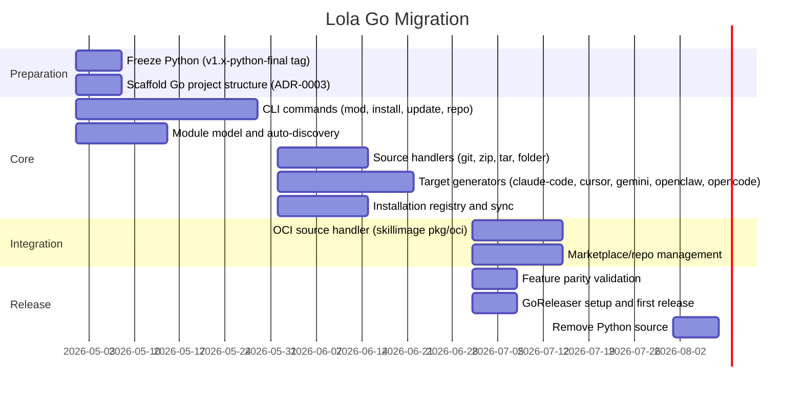

# Go Migration — Implementation Design

Paired with [ADR-0002: Go Migration](../../adr/0002-go-migration.md).

## Migration Timeline



## Coexistence Layout

During the transition, both Python and Go source live in the same repository:

```
lola/
├── src/lola/              # FROZEN — Python source, tagged v1.x-python-final
├── cmd/lola/main.go       # NEW — Go entry point
├── internal/              # NEW — Go private packages
├── pkg/                   # NEW — Go public packages
├── go.mod                 # NEW
├── go.sum                 # NEW
├── .goreleaser.yaml       # NEW
├── pyproject.toml         # FROZEN — Python build config
├── uv.lock                # FROZEN
└── tests/                 # Existing Python tests (frozen)
```

CI runs both test suites:
- Python: `pytest` (existing, frozen)
- Go: `go test ./...` (new, growing)

## Tech Stack Details

### Cobra Command Registration

Each command is a separate file in `internal/cli/` following the one-file-per-command pattern. The root command registers all subcommands explicitly:

```go
func NewRootCmd() *cobra.Command {
    root := &cobra.Command{Use: "lola"}
    root.AddCommand(
        NewModCmd(),
        NewSkillCmd(),
        NewPluginCmd(),
        NewGroupCmd(),
        NewRepoCmd(),
        NewExtCmd(),
        NewInstallCmd(),
        NewUpdateCmd(),
        NewSearchCmd(),
        NewServeCmd(),
    )
    return root
}
```

### Viper Configuration

Viper handles all configuration sources in priority order:
1. CLI flags (highest)
2. Environment variables (`LOLA_*` prefix)
3. Project config (`lola.yml` or `lola.toml`)
4. Global config (`~/.lola/config.yml`)
5. Defaults (lowest)

Viper brings YAML (`go.yaml.in/yaml/v3`) and TOML (`pelletier/go-toml/v2`) as its own transitive dependencies — no separate imports needed.

### skillimage Package Usage

```go
import (
    "github.com/redhat-et/skillimage/pkg/oci"
    "github.com/redhat-et/skillimage/pkg/skillcard"
    "github.com/redhat-et/skillimage/pkg/lifecycle"
)
```

The OCI source handler uses `pkg/oci` to pull and unpack skill images, `pkg/skillcard` to parse `skill.yaml` metadata alongside `SKILL.md` frontmatter, and `pkg/lifecycle` to check skill lifecycle state (warn before installing deprecated skills).

### Frontmatter Parser

Hand-rolled, no external dependency:

```go
func ParseFrontmatter(content []byte, v any) (body []byte, err error) {
    parts := bytes.SplitN(content, []byte("---"), 3)
    if len(parts) < 3 {
        return content, nil
    }
    if err := yaml.Unmarshal(parts[1], v); err != nil {
        return nil, fmt.Errorf("parsing frontmatter: %w", err)
    }
    return bytes.TrimLeft(parts[2], "\n"), nil
}
```

## Python Feature Parity Checklist

Before removing Python source, the Go binary must pass:

- [ ] `lola mod add` from all source types (git, zip, tar, folder, URL variants)
- [ ] `lola mod rm`, `lola mod ls`, `lola mod update`, `lola mod info`
- [ ] `lola install` to all 5 targets with skills, commands, agents, MCPs, instructions
- [ ] `lola update` with orphan detection and removal
- [ ] `lola repo add/rm/ls/update/set` (renamed from market)
- [ ] `lola mod search` across repos
- [ ] `lola sync` from `.lola-req` / `lola.mod`
- [ ] Installation registry (YAML, atomic writes)
- [ ] Pre/post install hooks
- [ ] Module content auto-discovery (skills/, commands/, agents/, mcps.json, AGENTS.md)
- [ ] Single-skill and module-subdir layout support
- [ ] Skill name conflict resolution (prefixing)
- [ ] Backwards-compatible uninstall (old prefixed filenames)
