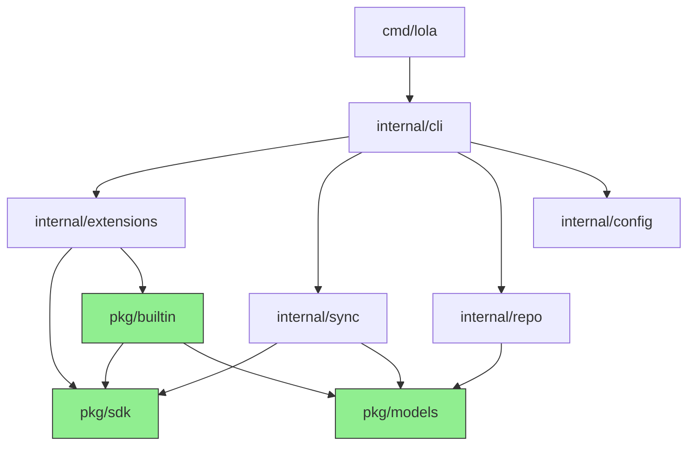

# Go Project Structure — Implementation Design

Paired with [ADR-0004: Go Project Structure](../../adr/0004-go-project-structure.md).

## Complete File Tree

```
cmd/
  lola/
    main.go                       # Thin entry, calls internal/cli

internal/
  cli/                            # Cobra commands — one file per subcommand
    root.go                       # Root command, version, shell completion
    mod.go                        # lola mod add|rm|ls|update|info|search
    skill.go                      # lola skill add|rm|ls|info|search
    plugin.go                     # lola plugin add|rm|ls|info|search
    group.go                      # lola group add|rm|ls|info|install
    repo.go                       # lola repo add|rm|ls|update|set
    ext.go                        # lola ext add|rm|ls|info|search
    install.go                    # lola install <module> -a <target>
    update.go                     # lola update
    search.go                     # lola search <query> [--type mod|skill|plugin|ext]
    serve.go                      # lola serve (future)

  extensions/                     # Extension discovery and lifecycle
    registry.go                   # Factory maps for built-in extensions
    discovery.go                  # Scan extension dir + PATH for externals
    runner.go                     # Execute external extensions via stdin/stdout

  config/                         # Viper configuration
    config.go                     # LOLA_HOME, MODULES_DIR, INSTALLED_FILE, etc.

  sync/                           # Install/uninstall/update orchestration
    install.go                    # install_to_target(), copy_module_to_local()
    update.go                     # update_module(), compute orphans
    uninstall.go                  # remove from target + registry

  frontmatter/                    # Hand-rolled YAML frontmatter parser
    parse.go                      # ParseFrontmatter(content, v) (body, err)

  repo/                           # Repository/marketplace management
    manager.go                    # RepoRegistry: add, update, search, resolve
    search.go                     # Cross-repo module search

  serve/                          # API server (future)
    server.go

pkg/
  sdk/                            # PUBLIC extension SDK
    extension.go                  # Base Extension interface, Kind type
    manifest.go                   # ExtensionManifest struct (YAML schema)
    target.go                     # TargetExtension interface
    source.go                     # SourceExtension interface
    repo.go                       # RepoExtension interface
    runtime.go                    # RuntimeExtension interface
    scan.go                       # ScanExtension interface

  builtin/                        # PUBLIC built-in extension implementations
    targets/
      claude_code.go              # Separate files, .claude/ paths
      cursor.go                   # Separate files, .cursor/ paths
      gemini.go                   # Managed section in GEMINI.md
      openclaw.go                 # Workspace-based
      opencode.go                 # Managed section in AGENTS.md
    sources/
      git.go                      # go-git/v5 shallow clone
      zip.go                      # stdlib archive/zip
      tar.go                      # stdlib archive/tar
      folder.go                   # os.CopyFS
      oci.go                      # imports skillimage pkg/oci
    repos/
      yaml.go                     # Standard YAML catalog handler
      oci.go                      # OCI registry catalog

  models/                         # PUBLIC shared model types
    module.go                     # Module, Skill, Command, Agent
    installation.go               # Installation, InstallationRegistry
    repo.go                       # Repo (was Marketplace)
    group.go                      # Group definition
```

## Package Dependency Flow



Green = public (`pkg/`), white = private (`internal/`).

## Cobra Command Registration

Each command file in `internal/cli/` exports a `NewXxxCmd()` function. The root command registers all subcommands explicitly — no magic discovery:

```
root.go: NewRootCmd()
  ├── mod.go:     NewModCmd()
  ├── skill.go:   NewSkillCmd()
  ├── plugin.go:  NewPluginCmd()
  ├── group.go:   NewGroupCmd()
  ├── repo.go:    NewRepoCmd()
  ├── ext.go:     NewExtCmd()
  ├── install.go: NewInstallCmd()
  ├── update.go:  NewUpdateCmd()
  ├── search.go:  NewSearchCmd()
  └── serve.go:   NewServeCmd()
```
