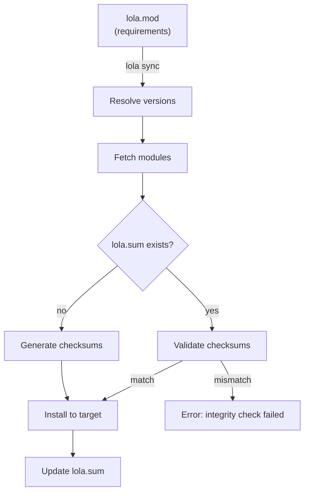
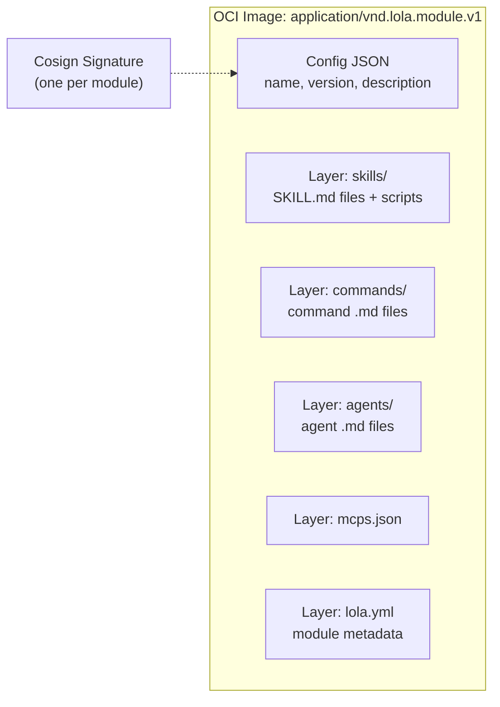

# Module Package Format — Implementation Design

Paired with [ADR-0005: Module Package Format](../../adr/0005-module-package-format.md).

## lola.mod Format

Declares module dependencies. Replaces `.lola-req` (kept as backwards-compatible alias).

```
# lola.mod — Lola module requirements
# Equivalent to go.mod for Go projects

module myproject

require (
    compliance-skills v1.2.0
    react-helpers ^2.0
    @mymarket/security-audit ~1.0
)
```

Version constraints follow the existing `.lola-req` syntax: `==`, `>=`, `<=`, `~` (tilde), `^` (caret).

## lola.sum Format

Stores SHA256 checksums of all installed module files. Generated automatically, committed to version control.

```
# lola.sum — Module integrity checksums
compliance-skills v1.2.0 skills/compliance-check/SKILL.md sha256:a1b2c3d4e5f6...
compliance-skills v1.2.0 commands/run-audit.md sha256:f6e5d4c3b2a1...
react-helpers v2.1.0 skills/react-hooks/SKILL.md sha256:1a2b3c4d5e6f...
```

Each line: `<module> <version> <filepath> sha256:<hash>`

## Dependency Flow



## .lola-req Backwards Compatibility

When `lola.mod` is not present but `.lola-req` exists, Lola reads `.lola-req` using the same parser. No format conversion is needed — both files use the same syntax. `lola.mod` is the canonical name going forward.

## OCI Module Artifact



- Artifact type: `application/vnd.lola.module.v1`
- Each component directory is a separate layer for efficient caching
- `lola.yml` layer contains module metadata
- One cosign signature covers the entire OCI artifact
- Compatible with any OCI-compliant registry

## Tarball Package

```
module-v1.0.0.tar.gz
├── lola.yml                    # Module metadata (optional)
├── skills/
│   └── my-skill/
│       └── SKILL.md
├── commands/
│   └── my-command.md
├── agents/
│   └── my-agent.md
└── mcps.json                   # MCP server config (optional)

module-v1.0.0.tar.gz.bundle     # Sigstore bundle (one signature)
```

- Standard `.tar.gz` archive
- Sigstore bundle covers the entire archive
- Used for git-based and file-based distribution
