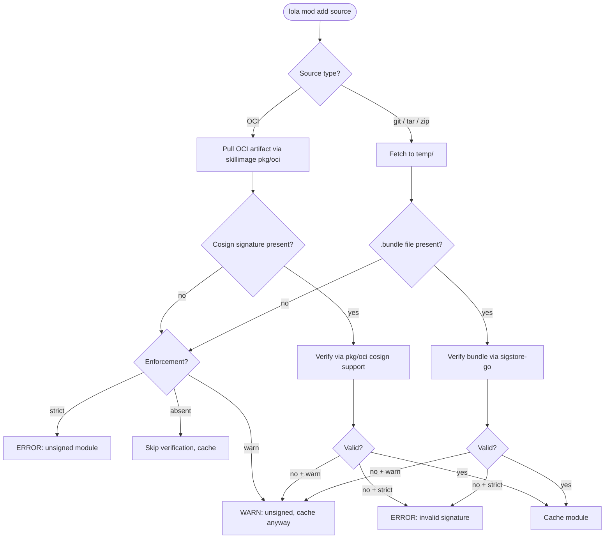
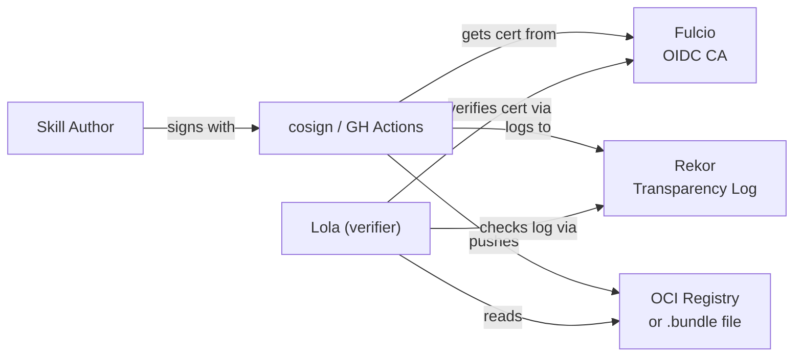

# Sigstore Integration — Implementation Design

Paired with [ADR-0006: Sigstore Integration](../../adr/0006-sigstore-integration.md).

## Verification Flow

Based on [issue #84](https://github.com/LobsterTrap/lola/issues/84):



## Enforcement Matrix

| `sign:` in repo | Bundle present | `enforcement` | Result |
|---|---|---|---|
| no | any | — | skip verification, cache |
| yes | no bundle | `warn` | warn, cache anyway |
| yes | no bundle | `strict` | error, discard |
| yes | invalid bundle | `warn` | warn, cache anyway |
| yes | invalid bundle | `strict` | error, discard |
| yes | valid bundle | any | verified, cache |

## Repo YAML Sign Field

```yaml
modules:
  - name: "openssf-skill"
    description: "OpenSSF Security Instructions"
    version: "v0.1.0"
    repository: "https://github.com/ryanwaite/openssf-skill.git"
    tags: ["openssf", "security"]
    sign:
      enforcement: warn    # warn | strict
```

## Identity Derivation

For GitHub-hosted modules, identity is derived from the repository URL:

```
Repository: https://github.com/org/repo
  → OIDC Issuer:  https://token.actions.githubusercontent.com
  → Subject:      repo:org/repo:*
```

This means skill authors sign using GitHub Actions OIDC (keyless) and Lola verifies against the expected identity without any additional configuration.

## Sigstore Components



- **Fulcio**: Free OIDC-based certificate authority, issues short-lived (10 min) certificates
- **Rekor**: Append-only transparency log for non-repudiation
- **cosign**: CLI/library for signing and verifying OCI artifacts and bundles

## GitHub Actions Signing Workflow

Reference workflow for skill authors to sign their modules:

```yaml
# .github/workflows/sign.yml
name: Sign Skills
on:
  push:
    tags: ['v*']

permissions:
  id-token: write    # Required for keyless signing
  contents: read

jobs:
  sign:
    runs-on: ubuntu-latest
    steps:
      - uses: actions/checkout@v4
      - uses: sigstore/cosign-installer@v3
      - run: |
          for f in skills/*/SKILL.md commands/*.md agents/*.md; do
            [ -f "$f" ] && cosign sign-blob "$f" --bundle "$f.bundle"
          done
```

## Scope Boundaries

**In scope (MVP):**
- Verification at add time for all add operations
- GitHub Actions OIDC identity derivation
- `sigstore-go/pkg/verify` for bundle verification
- OCI verification via skillimage `pkg/oci`
- Enforcement via repo YAML `sign:` field

**Out of scope (future):**
- GitLab, Bitbucket, self-hosted OIDC issuers
- Key-pair (offline) signing verification
- SLSA provenance attestation verification
- nono trust system integration (issue #62)
- Per-module `lola.yml` signing override
